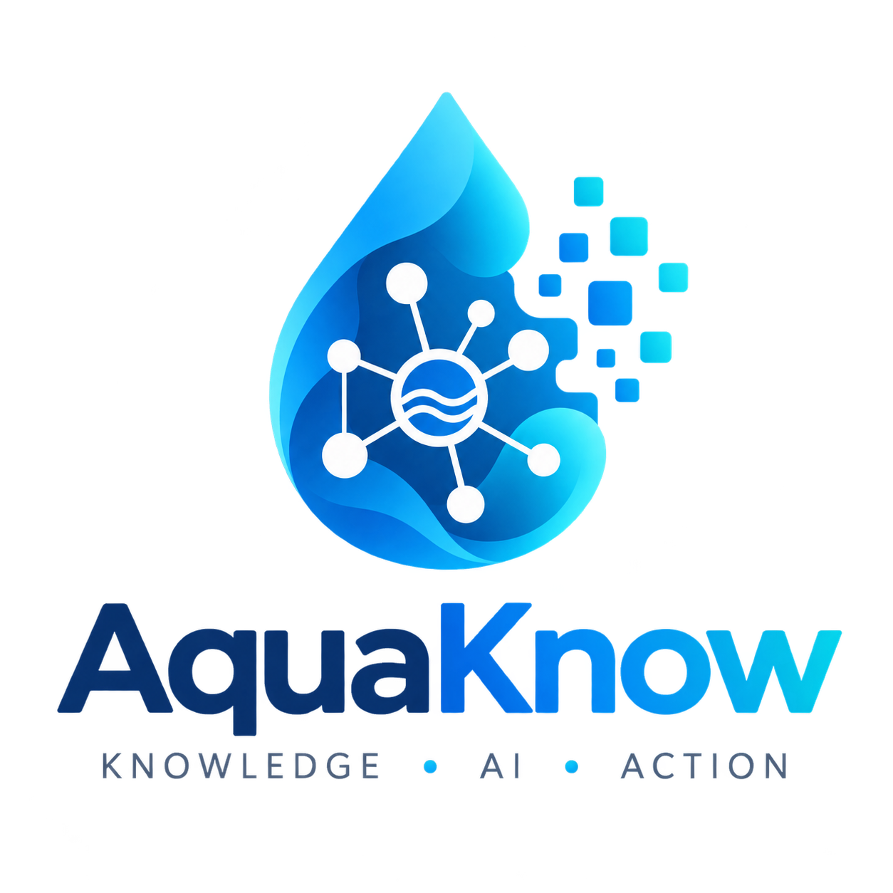

<p align="center">
  
</p>

# h2o

A knowledge platform for a manufacturer of connected, bottle-free water dispensers, built around one idea:

> **A human-authored SKOS vocabulary defines the entities. The language model uses it, and reports what it is missing. A person decides what gets added.**

The vocabulary is a precondition, not an output. Domain experts write version 1 before a single document is ingested, because a vocabulary induced from the corpus inherits exactly the inconsistencies it exists to fix.

## The loop

1. A user asks about a **"gas bottle"**. The agent resolves against the published vocabulary, finds nothing, says so honestly, and the miss is logged with the verbatim turn.
2. Ingestion had already parked 12 unresolved mentions of *"gas bottle"* across two service bulletins and the support FAQ. The gap queue merges both sources into **one evidenced entry** with a suggested attachment point: **CO₂ Cylinder**.
3. A domain expert opens the review card. The impact preview reads: *"Adding this alternative term will resolve 12 mentions across 3 documents."* They edit the wording and click **Save new version**. Integrity checks pass, the prior version freezes to history, the new one publishes.
4. Publishing fans out: the resolver index is rebuilt, the 12 held mentions are re-resolved and attached, 3 documents are re-indexed. The run and its counts appear in the console.
5. The same question now resolves, **and so does a question about the service bulletin that was unanswerable five minutes earlier.**

No code change. No redeploy.

There is a second loop driven by machines rather than people: the fleet emits an OpenTelemetry attribute that maps to no concept, and the same queue fills from the other side. See [ADR-003](docs/adrs/003-otel-fleet-signals-to-skos.md).

## What the model is not allowed to do

- Author vocabulary: no label, no definition, no IRI, no parent outside the existing tree.
- Write SPARQL. Tools execute parameterized templates.
- Write to the graph at all. The chat agent's IAM role has no write access.
- Resolve a contradiction. Both sides persist with their sources, flagged.
- Answer without grounding. It needs a resolved concept, a stored claim, or a retrieved snippet, or it says it does not know.

## Stack

| Layer | Technology |
| --- | --- |
| Vocabulary | SKOS concept schemes, authored as Turtle in `vocab/` |
| Graph | Embedded Oxigraph over S3 (SPARQL 1.1, zero idle cost). Neptune Serverless is a documented swap |
| Agent | Strands Agents SDK on AWS Bedrock AgentCore Runtime |
| Model | Amazon Nova 2 Lite · Titan Text Embeddings V2 |
| Retrieval | Amazon S3 Vectors, filtered by resolved concept |
| API | FastAPI on Lambda + API Gateway, no VPC |
| Orchestration | EventBridge + Step Functions (publish fan-out) |
| Frontend | Next.js 15 + Vercel AI SDK, curation console and chat |
| IaC | CloudFormation |

## Layout

```
apps/agent/         Strands agent → AgentCore Runtime
apps/api/           FastAPI on Lambda: vocabulary, gaps, publish, ingest, runs
apps/frontend/      Next.js: vocabulary console (primary) + chat
packages/h2o_core/  SKOS models, SPARQL templates, store ports, resolver index,
                    integrity gate, impact preview, contradiction detector,
                    OTEL→SKOS mapper
vocab/              SKOS concept schemes (Turtle): business + telemetry
vocab/shapes/       SHACL shapes: the integrity gate, versioned beside the data
data/docs/          document corpus + registry.json (two seeded contradictions)
data/telemetry/     recorded OTLP fixture
infra/cloudformation/
docs/adrs/          architecture decisions: start with summary.md
docs/operations/    runbooks
```

## Status

Architecture decisions, the seed vocabulary, the document corpus, and a recorded telemetry fixture are written. No application code yet.

```
make check      # vocabulary: SHACL gate, resolver parity, OTEL mapping table
                # corpus:     registry, contradictions, gap counts, HTML rule
```

`scripts/check_vocab.py` validates the seed vocabulary against the SHACL shapes in `vocab/shapes/` ([ADR-005](docs/adrs/005-governance-and-downstream-orchestration.md)), adds a resolver-parity check for the label collisions SPARQL cannot see, asserts the two deliberate gaps are still open, and executes [ADR-003](docs/adrs/003-otel-fleet-signals-to-skos.md)'s mapping table against `data/telemetry/`, so the ADRs' claims are checked rather than asserted.

The corpus in `data/docs/` is six invented documents carrying two deliberate contradictions and one deliberate vocabulary gap, declared in `registry.json` and asserted by `scripts/check_corpus.py`. Nothing about it is described in prose that is not also checked.

Start with [docs/adrs/summary.md](docs/adrs/summary.md).
